Goal and Objectives
===================

In order for the Sales Teams to decide with which brand of computers
(Acer or Sony) to persue a deeper strategic relationship, a market
research firm has been engaged to conduct a survey on Blackwell’s
existing customers.

One of the objectives of the survey is to identify computer’s brand
preferences among the customers.

A model is to be developed and tested in order to predict the customer’s
brand preference based on other demographis data of an incomplete
survey. This will allow us at the same time to extrapolate the results
of the survey to all the customers and persue specific marketing
strategies.

Excecutive Summary
==================

The results of this report are not conclusive as to persue a strategic
partnership with Sony or Acer.

An additional survey following a random sampling strategy is needed in
order to estimate the population distribution of age and salary. In this
way, the market shares of Acer and Sony can be better assessed.

However, a model has been built on the available data and the brand
preference has been predicted on the incomplete survey. The share of
brands is (as expected) again around 60/40 being Sony the most popular.
However, this result should be validated following a random sampling
survey.

Data
====

The data used to develop the model contains around 10.000 survey of
customer’s brand preference including other demographic features:

-   Salary (yearly)
-   Age
-   Educational level
-   Make of primary car
-   Zipcode
-   Credit available
-   Computers’ brand preference (Acer/Sony)

Pre-processing the data
=======================

The data has been first reviewd and the attributes type have been
changed to be suited for the analysis.

Exploring the Data
==================

Below the summary of the complete survey is shown:

``` r
summary(CompleteResponses)
```

    ##      salary            age        elevel        car          zipcode    
    ##  Min.   : 20000   Min.   :20.00   0:2052   15     : 542   6      :1155  
    ##  1st Qu.: 52082   1st Qu.:35.00   1:1948   18     : 524   8      :1135  
    ##  Median : 84950   Median :50.00   2:1983   8      : 511   2      :1112  
    ##  Mean   : 84871   Mean   :49.78   3:1947   2      : 509   5      :1108  
    ##  3rd Qu.:117162   3rd Qu.:65.00   4:1968   17     : 508   4      :1087  
    ##  Max.   :150000   Max.   :80.00            5      : 505   0      :1085  
    ##                                            (Other):6799   (Other):3216  
    ##      credit        brand     
    ##  Min.   :     0   Acer:3744  
    ##  1st Qu.:120807   Sony:6154  
    ##  Median :250607              
    ##  Mean   :249176              
    ##  3rd Qu.:374640              
    ##  Max.   :500000              
    ## 

Histograms
----------

The distribution of the data has been studied using histograms. Below it
can be seen different histograms for the original data, as well as
histograms for the incomplete survey data. In this way we can compare
the distribution among both samples (i.e. original data and incomplete
data). The histograms have been segregated by brand, in order to look
for associations at the same time.

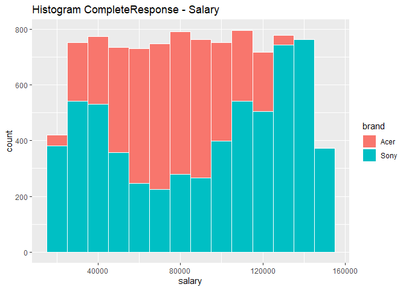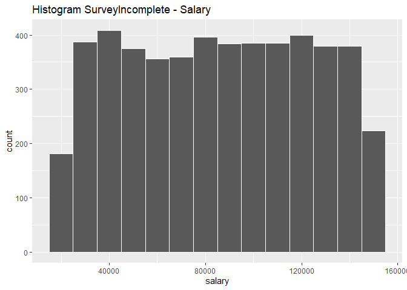

The overall distribution of salary is similar in both data sets. This is
very important in order to have a reliable model. On the other hand, it
can be seen that the distribution of salary for Acer fans is different
to the one of Sony fans. This revelas some dependancy between salary and
brand preference.

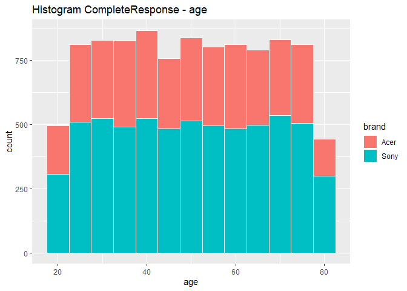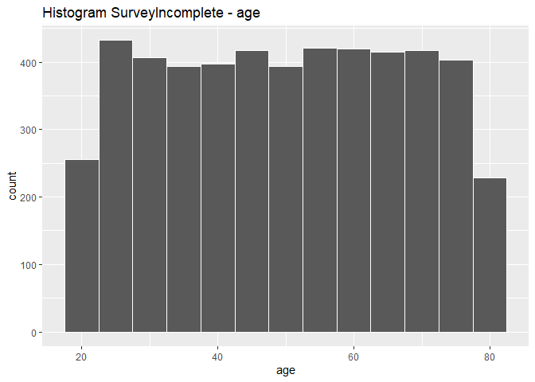

The overall distribution of age is also very similar among both
datasets. Unlike while looking at salary, in the case of age there is
not clear association between the latest and the brand.

    ## 'data.frame':    9898 obs. of  7 variables:
    ##  $ salary : num  119807 106880 78021 63690 50874 ...
    ##  $ age    : int  45 63 23 51 20 56 24 62 29 41 ...
    ##  $ elevel : Ord.factor w/ 5 levels "0"<"1"<"2"<"3"<..: 1 2 1 4 4 4 5 4 5 2 ...
    ##  $ car    : Factor w/ 20 levels "1","2","3","4",..: 14 11 15 6 14 14 8 3 17 5 ...
    ##  $ zipcode: Factor w/ 9 levels "0","1","2","3",..: 5 7 3 6 5 4 6 1 1 5 ...
    ##  $ credit : num  442038 45007 48795 40889 352951 ...
    ##  $ brand  : Factor w/ 2 levels "Acer","Sony": 1 2 1 2 1 2 2 2 1 2 ...

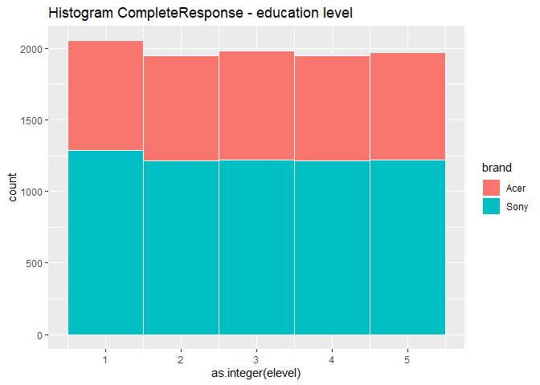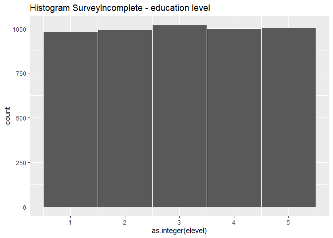

Key:

-   0 Less than High School Degree
-   1 High School Degree
-   2 Some College
-   3 4-Year College Degree
-   4 Master’s, Doctoral or Professional Degree

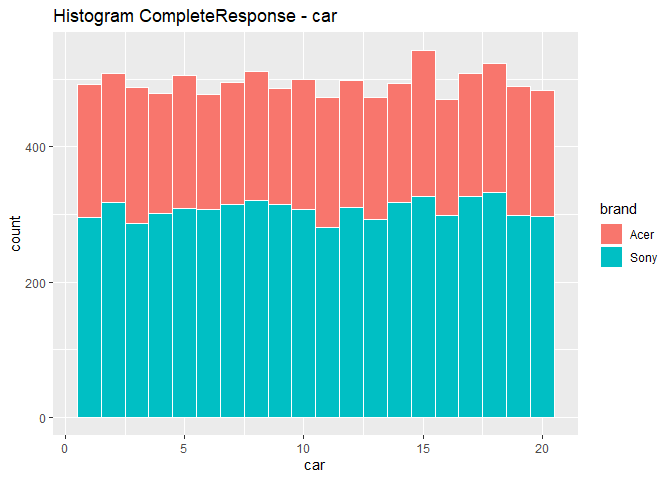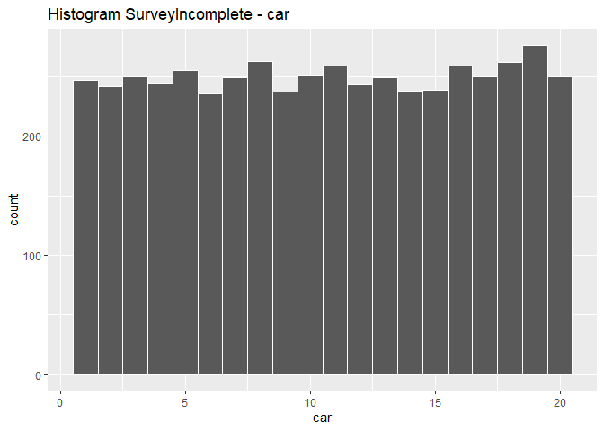

Key:

-   1 BMW
-   2 Buick
-   3 Cadillac
-   4 Chevrolet
-   5 Chrysler
-   6 Dodge
-   7 Ford
-   8 Honda
-   9 Hyundai
-   10 Jeep
-   11 Kia
-   12 Lincoln
-   13 Mazda
-   14 Mercedes Benz
-   15 Mitsubishi
-   16 Nissan
-   17 Ram
-   18 Subaru
-   19 Toyota
-   20 None of the above

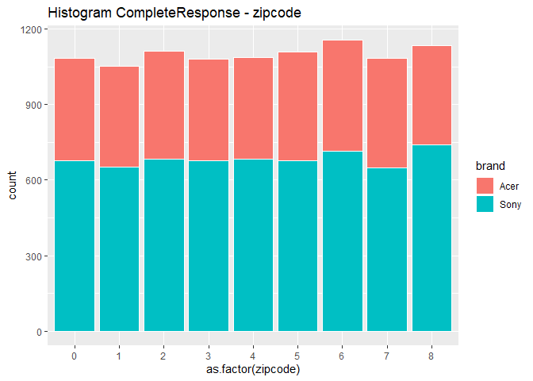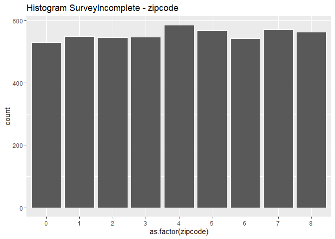

-   0 New England
-   1 Mid-Atlantic
-   2 East North Central
-   3 West North Central
-   4 South Atlantic
-   5 East South Central
-   6 West South Central
-   7 Mountain
-   8 Pacific

<!-- -->

    ## 'data.frame':    9898 obs. of  7 variables:
    ##  $ salary : num  119807 106880 78021 63690 50874 ...
    ##  $ age    : int  45 63 23 51 20 56 24 62 29 41 ...
    ##  $ elevel : Ord.factor w/ 5 levels "0"<"1"<"2"<"3"<..: 1 2 1 4 4 4 5 4 5 2 ...
    ##  $ car    : Factor w/ 20 levels "1","2","3","4",..: 14 11 15 6 14 14 8 3 17 5 ...
    ##  $ zipcode: Factor w/ 9 levels "1","2","3","4",..: 5 7 3 6 5 4 6 1 1 5 ...
    ##  $ credit : num  442038 45007 48795 40889 352951 ...
    ##  $ brand  : Factor w/ 2 levels "Acer","Sony": 1 2 1 2 1 2 2 2 1 2 ...

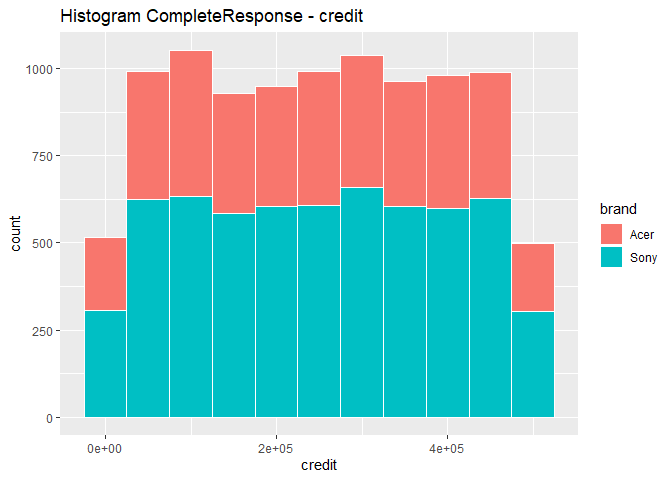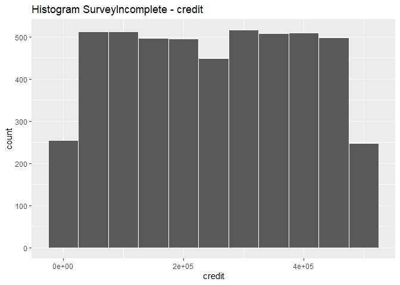

The distributions of education level, car, zipcode and credit are pretty
similar in both datasets. As explained before, this is very important in
order to have a reliable model.

Scatter plots
-------------

In order to explore deeper the relationship between the different
attributes and brand, scatter plots have been made.

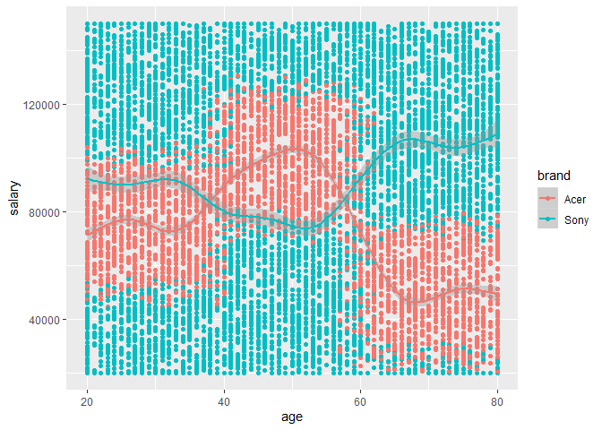

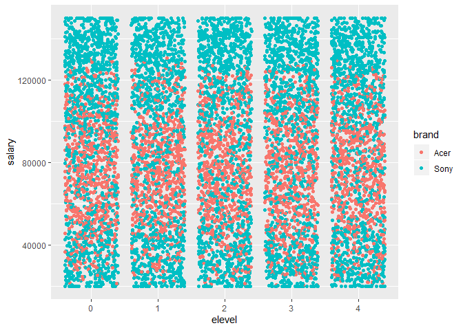

As can be seen in plot salary vs age, there is also a dependancy of
brand towards attribute age. On the other hand, there seems not to be
any association with education level and brand.

Looking for outliers
--------------------

Boxplots for the numerical attributes (salary and credit) have been
obtained. As can be seen there are no outliers in either one variable.

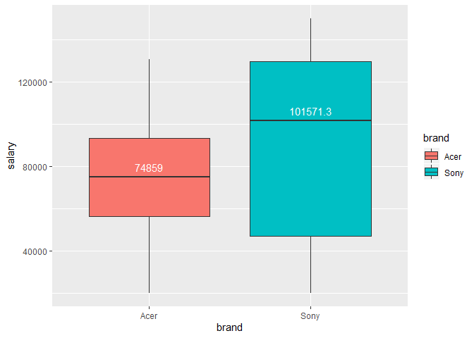

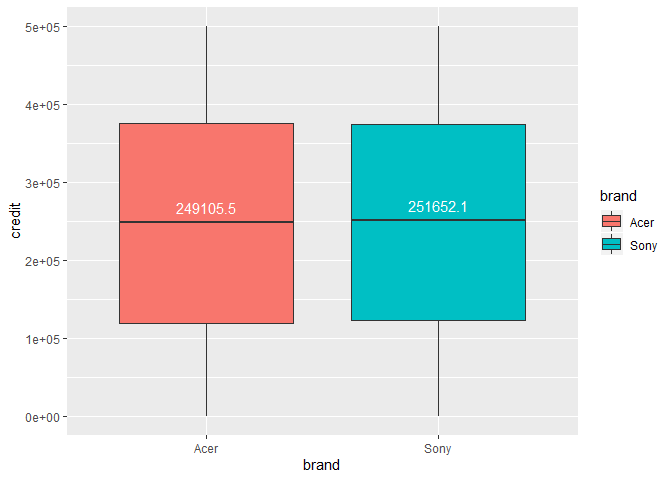

Feature selection
=================

A single Decision Tree has been obtained in order to select the
attributes which have an association to the investigated veriable,
brand.

As can be seen in the Decision Tree below, only salary and age play a
considerable role.

However, all attributes will be used for the development of the models,
since both models used in this study are decision-tree-based and the
unimportant attributes will be anyways discarded.

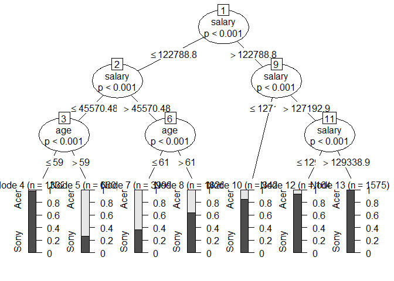

Modeling
========

Two different decision tree classification methods have been included:
C5.0 and RandomForest.

Creating training and testing sets
----------------------------------

In order to train and test the models, the original data (complete
survey) has been split into a training and a test set. The proportion
used is 0.75 to 0.25.

``` r
trainSize <- createDataPartition(y=CompleteResponses$brand, p = .75, list = F)
trainSet <- CompleteResponses[trainSize,]
testSet <- CompleteResponses[-trainSize,]
```

C5.0
----

### Hyperparameter selection with cross-validation (automatic tunning)

Hyperparameter selection has been done with R package caret using
automatic tunning with tunelength = 3. For the validation of models
(hyperparameters) the data has been resampled using cross-validation 10
folds. The cross-validation results for the tunning parameters can bee
seen below:

    ##    user  system elapsed 
    ##   98.32    0.72   99.18

``` r
modelo_c50_auto
```

    ## C5.0 
    ## 
    ## 7424 samples
    ##    6 predictor
    ##    2 classes: 'Acer', 'Sony' 
    ## 
    ## Pre-processing: centered (34), scaled (34) 
    ## Resampling: Cross-Validated (10 fold, repeated 1 times) 
    ## Summary of sample sizes: 6682, 6682, 6682, 6681, 6682, 6682, ... 
    ## Resampling results across tuning parameters:
    ## 
    ##   model  winnow  trials  ROC        Sens       Spec     
    ##   rules  FALSE    1      0.8790159  0.8945793  0.8399053
    ##   rules  FALSE   10      0.9659876  0.8739159  0.9166113
    ##   rules  FALSE   20      0.9664207  0.8789133  0.9125020
    ##   rules   TRUE    1      0.8751417  0.8767870  0.8429412
    ##   rules   TRUE   10      0.9763214  0.8835498  0.9337075
    ##   rules   TRUE   20      0.9766233  0.8856851  0.9324117
    ##   tree   FALSE    1      0.9319180  0.8586362  0.8587773
    ##   tree   FALSE   10      0.9765857  0.9020615  0.9235334
    ##   tree   FALSE   20      0.9778980  0.8988587  0.9254834
    ##   tree    TRUE    1      0.9262276  0.8241167  0.8607300
    ##   tree    TRUE   10      0.9786267  0.8985053  0.9254782
    ##   tree    TRUE   20      0.9793203  0.8992171  0.9263454
    ## 
    ## ROC was used to select the optimal model using the largest value.
    ## The final values used for the model were trials = 20, model = tree
    ##  and winnow = TRUE.

ROC has been used as a criterium to select the best model since ours is
a 2 class problem. ROC gives an indication of how well the clasification
has resulted. The closer to 1 the value of ROC, the best clasified are
the classes.

### Testing the model

After selecting the hyperparameters with cross-validation on the
training set, the test set is used to assess the generalization error of
the selected C5.0 model. Below the confusion matrix for the test set can
be appreciated. An accuracy of 0.9248 and a kappa of 0.8402 speak for a
very good prediction.

``` r
predict_c50_auto_classes <- predict(modelo_c50_auto, newdata = testSet)
predict_c50_auto_prob <- predict(modelo_c50_auto, newdata = testSet, type = "prob")
confusionMatrix(data = predict_c50_auto_classes, testSet$brand)
```

    ## Confusion Matrix and Statistics
    ## 
    ##           Reference
    ## Prediction Acer Sony
    ##       Acer  882  141
    ##       Sony   54 1397
    ##                                           
    ##                Accuracy : 0.9212          
    ##                  95% CI : (0.9099, 0.9315)
    ##     No Information Rate : 0.6217          
    ##     P-Value [Acc > NIR] : < 2.2e-16       
    ##                                           
    ##                   Kappa : 0.8354          
    ##                                           
    ##  Mcnemar's Test P-Value : 7.34e-10        
    ##                                           
    ##             Sensitivity : 0.9423          
    ##             Specificity : 0.9083          
    ##          Pos Pred Value : 0.8622          
    ##          Neg Pred Value : 0.9628          
    ##              Prevalence : 0.3783          
    ##          Detection Rate : 0.3565          
    ##    Detection Prevalence : 0.4135          
    ##       Balanced Accuracy : 0.9253          
    ##                                           
    ##        'Positive' Class : Acer            
    ## 

Random Forest
-------------

### Hyperparameter selection with cross-validation (manual tunning)

For the hyperparameter selection the R package caret with manual tunning
has been used. Tunning has been done across parameter mtry = \[1,2,3\].
10-fold cross validation and 1 repetition has been used to limit
computational time.

``` r
rf_ctrl <- trainControl(method = "repeatedcv", 
                     repeats = 1,
                     classProbs = T,
                     summaryFunction = twoClassSummary)

rf_grid <- expand.grid(mtry=c(1,2,3))

system.time(modelo_rf_man <- train(brand ~ ., 
                                   data = trainSet, 
                                   method = "rf", 
                                   trControl = rf_ctrl, 
                                   tuneGrid= rf_grid,
                                   metric = "ROC",
                                   preProc = c("center", "scale")))
```

    ##    user  system elapsed 
    ##  246.65    4.64  252.06

### Testing the model

As can be seen in the cofusion matrix of prediction on the test set
using the random forest model selected in previous step, accuracy (0.75)
and kappa (0.41) are much lower than the ones obtained with C5.0 and
automatic hyperparameter tunning.

``` r
predict_rf_man_classes <- predict(modelo_rf_man, newdata = testSet)
head(predict_rf_man_classes)
```

    ## [1] Sony Sony Acer Sony Sony Sony
    ## Levels: Acer Sony

``` r
confusionMatrix(data = predict_rf_man_classes, testSet$brand)
```

    ## Confusion Matrix and Statistics
    ## 
    ##           Reference
    ## Prediction Acer Sony
    ##       Acer  311   78
    ##       Sony  625 1460
    ##                                           
    ##                Accuracy : 0.7158          
    ##                  95% CI : (0.6976, 0.7336)
    ##     No Information Rate : 0.6217          
    ##     P-Value [Acc > NIR] : < 2.2e-16       
    ##                                           
    ##                   Kappa : 0.3179          
    ##                                           
    ##  Mcnemar's Test P-Value : < 2.2e-16       
    ##                                           
    ##             Sensitivity : 0.3323          
    ##             Specificity : 0.9493          
    ##          Pos Pred Value : 0.7995          
    ##          Neg Pred Value : 0.7002          
    ##              Prevalence : 0.3783          
    ##          Detection Rate : 0.1257          
    ##    Detection Prevalence : 0.1572          
    ##       Balanced Accuracy : 0.6408          
    ##                                           
    ##        'Positive' Class : Acer            
    ## 

``` r
postResample(predict_rf_man_classes, testSet$brand)
```

    ##  Accuracy     Kappa 
    ## 0.7158448 0.3179099

### Hyperparameter selection with cross-validation (automatic tunning)

Now the automatic grid search of caret package is used for the
hyperparameter selection of random forest. Again model is validated with
10-fold cross-validation.

``` r
rf_ctrl <- trainControl(method = "repeatedcv", 
                        repeats = 1,
                        classProbs = T,
                        summaryFunction = twoClassSummary)

system.time(modelo_rf_auto <- train(brand ~ ., 
                                    data = trainSet, 
                                    method = "rf", 
                                    trControl = rf_ctrl, 
                                    tuneLength= 3,
                                    metric = "ROC",
                                    preProc = c("center", "scale")))
```

    ##    user  system elapsed 
    ##  304.86    4.29  309.81

### Testing the model

The confusion matrix of the predicted brands for the random forest
selected with automatic tunning is shown below. An accuracy of 0.9232
and a kappa of 0.8362 indicate a very similar espected error as with
C5.0.

``` r
predict_rf_auto_classes <- predict(modelo_rf_auto, newdata = testSet)
confusionMatrix(data = predict_rf_auto_classes, testSet$brand)
```

    ## Confusion Matrix and Statistics
    ## 
    ##           Reference
    ## Prediction Acer Sony
    ##       Acer  841  106
    ##       Sony   95 1432
    ##                                           
    ##                Accuracy : 0.9188          
    ##                  95% CI : (0.9073, 0.9292)
    ##     No Information Rate : 0.6217          
    ##     P-Value [Acc > NIR] : <2e-16          
    ##                                           
    ##                   Kappa : 0.8277          
    ##                                           
    ##  Mcnemar's Test P-Value : 0.4806          
    ##                                           
    ##             Sensitivity : 0.8985          
    ##             Specificity : 0.9311          
    ##          Pos Pred Value : 0.8881          
    ##          Neg Pred Value : 0.9378          
    ##              Prevalence : 0.3783          
    ##          Detection Rate : 0.3399          
    ##    Detection Prevalence : 0.3828          
    ##       Balanced Accuracy : 0.9148          
    ##                                           
    ##        'Positive' Class : Acer            
    ## 

``` r
postResample(predict_rf_auto_classes, testSet$brand)
```

    ##  Accuracy     Kappa 
    ## 0.9187551 0.8276799

Selecting the model
-------------------

Considering the results above, models C5.0 and random forest, both with
automatic tunning, are good models. However, model C5.0 will be selected
for requiring considerably less computation time. The error metrics are:

-   Accuracy: 0.9248
-   Kappa: 0.8402

The selected model has been used to predict the customer’s computer
brand preference in the incomplete survey. A sample of the result is
shown below. The complete file is attached to this report.

``` r
predict2 <- predict(modelo_c50_auto, SurveyIncomplete)
SurveyIncomplete$brand <- predict2
head(SurveyIncomplete)
```

    ##      salary age elevel car zipcode    credit brand
    ## 1 110499.74  54      3  15       5 354724.18  Acer
    ## 2 140893.78  44      4  20       8 395015.34  Sony
    ## 3 119159.65  49      2   1       4 122025.09  Acer
    ## 4  20000.00  56      0   9       2  99629.62  Sony
    ## 5  93956.32  59      1  15       2 458679.83  Acer
    ## 6  41365.43  71      2   7       3 216839.72  Acer

``` r
summary(SurveyIncomplete)
```

    ##      salary            age        elevel        car          zipcode    
    ##  Min.   : 20000   Min.   :20.00   0: 981   19     : 276   5      : 585  
    ##  1st Qu.: 52242   1st Qu.:35.00   1: 993   8      : 263   8      : 571  
    ##  Median : 85969   Median :50.00   2:1020   18     : 262   6      : 568  
    ##  Mean   : 85560   Mean   :49.87   3:1001   11     : 259   9      : 563  
    ##  3rd Qu.:118380   3rd Qu.:65.00   4:1005   16     : 259   2      : 549  
    ##  Max.   :150000   Max.   :80.00            5      : 255   4      : 548  
    ##                                            (Other):3426   (Other):1616  
    ##      credit        brand     
    ##  Min.   :     0   Acer:2067  
    ##  1st Qu.:121879   Sony:2933  
    ##  Median :250871              
    ##  Mean   :249510              
    ##  3rd Qu.:375425              
    ##  Max.   :500000              
    ## 

As can be seen in the summary, 63% of customer of the incomplete survey
prefer Sony (3174) and 41% prefer Acer (1826)

``` r
#modelLookup("rf")
```
